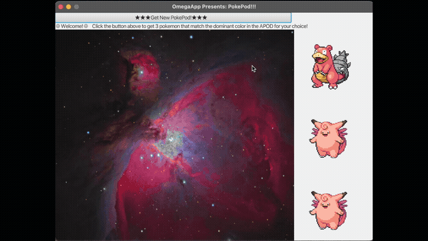

# PokePod

Enter your birthday → get the NASA Astronomy Picture of the Day for that date → receive your Pokémon based on the dominant color in the image.

**[→ Try it live](https://prachidpatel.github.io/pokemon-space-gen/)**

---

## How it works

1. You enter a birthday
2. NASA's APOD API returns the astronomy image for that date
3. Every pixel in the image is analyzed using a color classification algorithm (Manhattan RGB distance) to find the dominant hue
4. PokéAPI returns a random Pokémon matching that color group

The pixel analysis is a direct port of the original JavaFX desktop app — same weighted color buckets, same distance formula, just translated from Java's `PixelReader.getArgb()` to the Canvas `getImageData()` API.

## To run the original javafx applet
1. Pull repo
2. run ./compile
3. It should work! 

## Stack

- NASA APOD API
- PokéAPI
- HTML / CSS / JavaScript
- Java 11 + JavaFX (original desktop version, source in `src/`)
